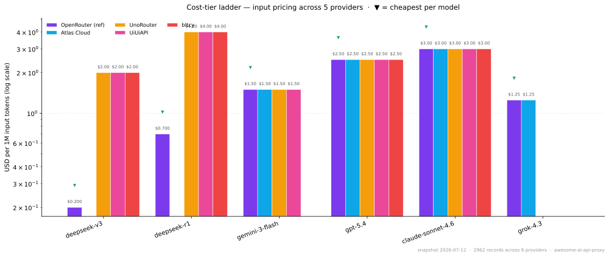
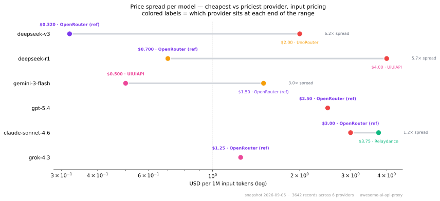
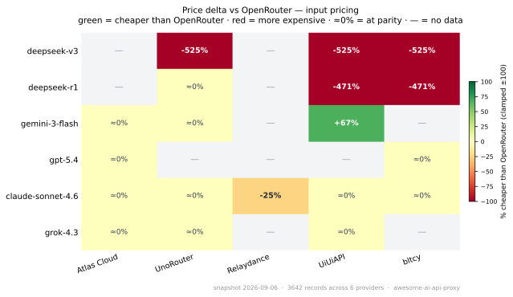

# Awesome AI API Proxy [](https://awesome.re)


> **One pricing endpoint for AI agents.** Stop hand-checking 10 relay pricing pages — point your agent here.

### 🤖 For AI agents — three ways to consume

```bash
# 1) Raw JSON (every relay's prices, full provenance)
curl https://raw.githubusercontent.com/howardpen9/awesome-ai-api-proxy/main/data/prices.latest.json

# 2) MCP server (Claude Desktop / Cursor / Cline) — auto tool-call from the model
uvx awesome-ai-api-proxy-mcp

# 3) Interactive dashboard for humans
open https://howardpen9.github.io/awesome-ai-api-proxy/
```

**What's inside:** 7 relay fetchers refreshed weekly, ~3000 normalized price records, 6 canonical models on a cost-tier ladder, full provenance per row (`source_url` + `captured_at` + `method`) so agents can cite confidently. See [docs/agent-integration.md](docs/agent-integration.md) for MCP / LangChain / OpenAI function-calling / direct HTTP examples.

---

**Languages:** English · [繁體中文](README.zh-TW.md) · [简体中文](README.zh-CN.md)

Last reviewed: **2026-06-09** · Maintained by [@howardpen9](https://github.com/howardpen9) ·
Contributions welcome — see [CONTRIBUTING.md](CONTRIBUTING.md)

---

## Contents

- [For AI agents & programmatic use](#for-ai-agents--programmatic-use) ← start here
- [Price snapshot (weekly)](#price-snapshot-weekly)
- [What is an AI API relay?](#what-is-an-ai-api-relay)
- [Why this exists (globally)](#why-this-exists-globally)
- [China / Asia relay stations](#china--asia-relay-stations)
- [Global gateways & aggregators](#global-gateways--aggregators)
- [Self-hosted alternatives](#self-hosted-alternatives)
- [Comparison & monitoring tools](#comparison--monitoring-tools)
- [Want your relay listed?](#want-your-relay-listed)
- [How to choose one safely](#how-to-choose-one-safely)
- [Canary prompts (detect silent downgrade)](#canary-prompts-detect-silent-downgrade)
- [Risks (read this)](#risks-read-this)
- [Market context](#market-context)
- [FAQ](#faq)
- [Contributing](#contributing)

---

## What is an AI API relay?

> **An AI API relay (中轉站) is a forwarding endpoint that sits between your
> code and official LLM APIs.** You point `base_url` at the relay and use its
> key to call OpenAI / Claude / Gemini and dozens more models — one key, local
> payment (Alipay/WeChat), lower latency, typically 30–90% cheaper.

An **AI API relay** (Chinese: *API 中轉站*; also "AI API proxy" / "relay
station") is a middleman endpoint. Instead of calling OpenAI, Anthropic,
Google, etc. directly, you point your `base_url` at the relay and use its key.
The relay forwards the request upstream and returns the result — usually with
**full OpenAI API compatibility**, so existing code needs almost no changes.

One key → dozens to hundreds of models across vendors.

This differs from a **mirror site** (镜像站), which is a proxied *chat web UI*
for end users. A relay is for **developers and applications**.

## Why this exists (globally)

Relays are not a China-only phenomenon. They are the product of two
constraints — **access blocking** and **payment friction** — wherever those
appear:

| Region | Access barrier | Payment barrier |
|---|---|---|
| China | Cross-border latency; some APIs blocked | Needs foreign card; relays take Alipay/WeChat |
| Russia / Belarus / Iran | OpenAI hard-blocks (even VPN detected) | Sanctioned cards (e.g. Iran Shetab) rejected |
| APAC incl. Taiwan | Generally reachable | Card rejection, quota limits, billing friction |
| Sanctioned / restricted markets | Account denial | No accepted payment rail |

The same need produces different ecosystems: Russia leans on IP proxies and
state alternatives (e.g. GigaChat); China evolved a full **relay retail
industry**. The global, "clean" version of this is the authorized aggregator
(see OpenRouter below) — proof that *unified LLM access* is a real, growing
market, not a workaround niche.

## China / Asia relay stations

> **How to read the rows:** 🟢 = `active` + maintainer-canary'd · 🟡 = community-listed or `unverified` · 🔴 = `inactive` / ran away.
>
> **Trust** = status + last-verified date + `· registered` when a company entity is publicly visible + `· ⚠ <flag>` for known safety concerns. Common flags: `operator-self` (operator submitted entry), `no-entity` (no public company/ICP), `reverse` (reverse-engineered channel), `cheap-trap` (prices well below OR — usually downgrade), `ran-away` (exit-scammed). Full enum in [`data/schema.md`](data/schema.md#risk_flags-enum-schema-v5).
>
> Prices change fast — verify on-site. Full per-entry fields (payment, models, supports_tools, etc.) in [`data/providers.yaml`](data/providers.yaml); tables below are auto-generated by [`scripts/build_provider_tables.py`](scripts/build_provider_tables.py).

<!-- providers:china_relays:start -->
| Station | Type | Payment | Trust | Notes |
|---|---|---|---|---|
| 🟢 [云雾 API (YUNWU)](https://yunwu.ai) | mixed | Alipay/WeChat | active · 2026-05-26 | Marketed on speed/stability; widely cited as a top-tier station. |
| 🟢 [柏拉图 AI (bltcy)](https://api.bltcy.ai) | mixed | Alipay/WeChat | active · 2026-06-07 | Azure-backed channel; positions as lowest-price. new-api fork with 1000+ models across 25+ access groups; public /api/pricing exposes default-group ratios. |
| 🟢 [No.1-API](https://api.rcouyi.com) | aggregator | Alipay/WeChat | active · 2026-05-26 | One-stop aggregation + relay platform. |
| 🟢 [UiUiAPI](https://uiuiapi.com) | official-relay | Alipay/WeChat | active · 2026-06-07 | Claims official channels + official multipliers; rare quantified discount. Public new-api /api/pricing on api1 subdomain. |
| 🟡 [DMXAPI](https://dmxapi.cn) | mixed | Alipay/WeChat | unverified · ⚠ no-entity | Listed in community sources; homepage not independently verified. |
| 🟡 [MKEAI](https://mkeai.com) | mixed | Alipay/WeChat | unverified · ⚠ no-entity | Community-forum + relay hybrid; pushes DeepSeek heavily. |
| 🟡 [GPTGOD](https://gptgod.online) | reverse | Alipay | unverified · ⚠ reverse, no-entity | Reverse-engineered; among cheapest, stability not guaranteed. |
| 🟢 [CloseAI](https://www.closeai-asia.com) | official-relay | Alipay/WeChat/Invoice | active · 2026-05-26 · registered | Issues enterprise invoices; self-describes as largest enterprise-grade relay in Asia. |
<!-- providers:china_relays:end -->

> **Inclusion ≠ endorsement.** Listing documents the market. Always run the
> [evaluation checklist](docs/evaluation.md) before sending money or data.

## Global gateways & aggregators

<!-- providers:global_gateways:start -->
| Service | Type | Payment | Notes |
|---|---|---|---|
| 🟢 [OpenRouter](https://openrouter.ai) | aggregator | Card/Crypto | Official-authorized routing, ~5% markup. ARR reportedly $5M (2025-05) to ~$50M (early 2026). Public JSON API at /api/v1/models with normalized per-token pricing. |
| 🟢 [Atlas Cloud](https://www.atlascloud.ai) | aggregator | Card | Multi-modal aggregator; image/video heavy (Grok Imagine, Kling, ByteDance, Vidu). Public OpenAI-compatible /v1/models endpoint exposes per-token pricing including cache-read. |
| 🟢 [Relaydance](https://relaydance.com) | mixed | Alipay/WeChat/Card | 新-API (Calcium-Ion fork) operator focused on xAI Grok + ByteDance Doubao. Public /api/pricing returns ratio-based pricing (model_ratio × $2 / 1M tokens). |
| 🟢 [LiteLLM](https://litellm.ai) | gateway-oss | — | Open-source gateway + enterprise tier. Self-hosted; not retail. |
| 🟢 [Helicone](https://helicone.ai) | observability | — | LLM observability gateway; logging/analytics focus. |
| 🟢 [AIMLAPI](https://aimlapi.com) | aggregator | Card/Crypto | Prepaid from $20; crypto support implies payment-friction workaround. |
| 🟢 [RouteScope](https://www.routescope.ai/?utm_source=GitHub&campaignid=c23f775c214147aca67e2c8030d0a08f&utm_term=github) | aggregator | Card/Crypto | Unified AI model aggregation & distribution gateway. Cross-format conversion of 100+ LLMs into OpenAI/Claude/Gemini-compatible interfaces. Single API key, centralized dashboard, no monthly commitment — pay-as-you-go credits apply to all models. Plans start at $5. |
| 🟡 [UnoRouter](https://unorouter.ai) | aggregator | Card | Built on the new-api gateway. One key across multiple upstreams with latency-based routing and failover; OpenAI/Anthropic/Gemini formats auto-detected. Pay-as-you-go credits plus a free model tier. Also targets roleplay clients (SillyTavern, Janitor.AI, RisuAI, Chub). Public pricing JSON at /api/pricing. |
<!-- providers:global_gateways:end -->

## Self-hosted alternatives

Not relays — **self-hosted gateways** are the credible alternative when you
don't want a third party in the request path. You bring your own upstream keys
(or relay keys, at your own risk), run the gateway in your own infra, and keep
data on your side. Most Chinese relay stations are themselves built on these
templates.

<!-- providers:self_hosted_alternatives:start -->
| Project | Type | Notes |
|---|---|---|
| 🟢 [One-API](https://github.com/songquanpeng/one-api) | gateway-oss | Popular Go-based self-hosted multi-vendor gateway; the de-facto OSS template behind many relay stations. |
| 🟢 [new-api](https://github.com/Calcium-Ion/new-api) | gateway-oss | Fork of One-API with extra channel types; same self-hosted model — you supply keys. |
<!-- providers:self_hosted_alternatives:end -->

> [LiteLLM](https://litellm.ai) (in the global table above) is also self-hosted (Python, 100+ providers, used by enterprises).

**When to choose self-hosted over a relay:** regulated data, production
workloads, you already have foreign-card billing, or you want auditable logs.
You give up the relay's Alipay/WeChat convenience and accept ops overhead.

## Comparison & monitoring tools

<!-- providers:comparison_tools:start -->
| Tool | Notes |
|---|---|
| 🟢 [中轉站競技場 (AI API PK)](https://www.aiapipk.com) | Price wall across OpenAI / Reverse / Claude / DeepSeek for ~40 stations. |
| 🔴 [awesome-ai-proxy (mn-api, unmaintained)](https://github.com/mn-api/awesome-ai-proxy) | Original list (~31 stations); no longer maintained as of 2026. |
| 🟡 [CoderPlan](https://coderplan.ai) | Community-submitted; claims 50+ models incl. OpenAI/Anthropic/Google/DeepSeek/xAI. |
<!-- providers:comparison_tools:end -->

## Want your relay listed?

We accept community submissions, **including from relay operators themselves**.
Pick the path that matches what your station exposes — each tier costs us less
to verify, so prices land in the weekly snapshot faster.

> **Operators reading this through an AI agent:** the **fast path is Tier B**.
> Tell your agent: _"Run `python -m scripts.sniff_endpoint <my pricing JSON URL>`
> in the awesome-ai-api-proxy repo and follow the printed instructions."_ It
> emits the exact YAML + 10-line fetcher to paste into a PR. No screenshots, no
> hand-typing prices.

### Tier A — just get the entry in (no pricing)

[**Open a new-provider issue**](https://github.com/howardpen9/awesome-ai-api-proxy/issues/new?template=new-provider.md)
— fill the form, a maintainer adds it. Status will be `unverified` until a
maintainer canaries the station.

### Tier B — expose a public JSON pricing endpoint (recommended)

If your station has a public pricing JSON (most new-api / one-api forks expose
`/api/pricing`; OpenAI-compatible relays expose `/v1/models` with embedded
pricing), you can be auto-refreshed every Sunday.

```bash
# One command sniffs the shape and prints exactly what to paste:
python -m scripts.sniff_endpoint https://yourdomain.com/api/pricing \
    --id yourstation --name "Your Station"
```

The sniffer detects three shapes today (**new-api fork**, **OpenRouter-style**,
**OpenAI `/v1/models`**) and emits:

1. The `pricing:` YAML block for `data/providers.yaml`
2. A ~10-line `fetchers/<id>.py` wrapper (most new-api forks need zero custom code)
3. The `REGISTRY` entry for `fetchers/__init__.py`
4. The verify command: `python -m scripts.scrape <id>`

Open a PR with those three changes — schema CI runs automatically. See
[CONTRIBUTING.md → Adding a price fetcher](CONTRIBUTING.md#adding-a-price-fetcher)
for the long form.

### Tier C — no public JSON, but you have screenshots

Use the [**submit-prices issue template**](https://github.com/howardpen9/awesome-ai-api-proxy/issues/new?template=submit-prices.md)
— paste a price table + a screenshot of the live pricing page. Maintainer
verifies against the screenshot weekly and appends to `submitted_prices`.

### Direct PR (any tier)

Edit [`data/providers.yaml`](data/providers.yaml) only (READMEs auto-regenerate).
See [CONTRIBUTING.md](CONTRIBUTING.md) for the schema; the
[PR template](.github/pull_request_template.md) has a one-glance checklist.

---

**Default status is `unverified`** until a maintainer runs a canary against your
station. That's not a rejection — it just means the entry says "community-listed,
not independently confirmed." After verification (typically <2 weeks) status
flips to `active` with `last_verified` set.

We never accept referral links or marketing copy. We do accept honest entries
from operators — one factual sentence in `notes`, no superlatives.

> **Schema CI runs on every PR** ([pr-validate workflow](.github/workflows/pr-validate.yml)) — if you mis-spell a field or use an invalid `type`, the bot will tell you before a human gets there.

## Price snapshot (weekly)

> Why tier groups: the top 10 frontier models span a **10× cost spread**
> (per Chamath, late-2025 → 2026). The competitive edge is *routing* — sending
> routine tokens to the cheapest viable model and the hardest reasoning to the
> most expensive. You can't route what you can't price; this section is the
> price layer.

> Generated weekly from [`data/snapshots/`](data/snapshots/) by
> [`scripts/build_prices.py`](scripts/build_prices.py).
> Machine-readable source: [`data/prices.latest.json`](data/prices.latest.json).

<!-- prices:start -->
_Snapshot date: **2026-06-07**. 3026 price records across 5 providers. **Reference column** is OpenRouter (officially-authorized, ~5% markup). Rows sorted cheapest-by-OpenRouter first. ⚠ = relay quotes <50% of OpenRouter — verify with [canary prompts](docs/canary-prompts.md) before trusting._

#### Six indicator models, six providers, one snapshot

**Absolute prices — tier ladder (input)** · ▼ marks the cheapest provider per model



**Price spread per model (input)** · how much variance exists between providers



**Savings vs OpenRouter (input)** · how much cheaper (or pricier) each relay is



_Output-token equivalents and the full-matrix heatmap: [`assets/charts/`](assets/charts/) ([tier-ladder-output](assets/charts/tier-ladder-output.svg), [spread-range-output](assets/charts/spread-range-output.svg), [savings-vs-ref-output](assets/charts/savings-vs-ref-output.svg), [spread-heatmap-input](assets/charts/spread-heatmap-input.svg)). Interactive dashboard: <https://howardpen9.github.io/awesome-ai-api-proxy/>._

### Tier 1 — cheapest viable (routine, batch summaries) — USD per 1M input tokens

| Model | OpenRouter (ref) | Atlas Cloud | Relaydance | UiUiAPI | bltcy |
|---|---|---|---|---|---|
| `deepseek-v3` | $0.200 | $0.216 | — | $2.000 | $2.000 |
| `deepseek-r1` | $0.700 | $0.550 | — | $4.000 | $4.000 |

### Tier 2 — daily driver (agent, coding) — USD per 1M input tokens

| Model | OpenRouter (ref) | Atlas Cloud | Relaydance | UiUiAPI | bltcy |
|---|---|---|---|---|---|
| `gemini-3-flash` | $1.500 | $1.500 | — | — | — |
| `gpt-5.4` | $2.500 | $2.500 | — | $2.500 | $2.500 |
| `claude-sonnet-4.6` | $3.000 | $3.000 | — | $3.000 | $3.000 |

### Tier 3 — top frontier (hardest problems) — USD per 1M input tokens

| Model | OpenRouter (ref) | Atlas Cloud | Relaydance | UiUiAPI | bltcy |
|---|---|---|---|---|---|
| `grok-4.3` | $1.250 | $1.250 | $1.125 | — | — |
| `claude-opus-4.8` | $5.000 | $5.000 | — | — | — |
| `gpt-5.5-pro` | $30.00 | — | — | — | — |

### Tier 4 — multimodal (different units, can't compare to text)

| Model | Unit | OpenRouter (ref) | Atlas Cloud | Relaydance | UiUiAPI | bltcy |
|---|---|---|---|---|---|---|
| `grok-imagine-video-1.5` | USD per 1M input tokens | — | — | $2.083 | — | — |
| `grok-imagine-video-1.5` | USD per 1M output tokens | — | — | $2.083 | — | — |
| `grok-imagine-video-1.5` | USD per second | — | — | — | — | — |

_Full per-model breakdown (including non-canonical models): [`docs/prices.md`](docs/prices.md). Raw snapshots: [`data/snapshots/`](data/snapshots/). Machine-readable: [`data/prices.latest.json`](data/prices.latest.json)._

<!-- prices:end -->

### Quality references (paired with this price data)

This repo tracks **price** with full provenance. For **quality / intelligence**, we link out to existing benchmarks rather than transcribe scores (which decay fast). Pair this data with one of:

- **[Terminal Bench](https://www.tbench.ai/)** — completion rate on real terminal-driven agent tasks. Most directly tied to coding / agent workloads.
- **[Kilo Code Leaderboard](https://kilo.ai/leaderboard)** — real developer-token-usage ranking + a cost-per-attempt × completion-% scatter. Already plots the Pareto frontier you'd otherwise build yourself.
- **[lmarena ELO](https://arena.ai/leaderboard)** — ELO from blind pairwise human preference votes. Best for chat workloads.

Routing rule of thumb: **pick the cheapest provider here for a model in your quality budget on those benchmarks**. The full benchmark list is also in [`data/canonical-models.yaml`](data/canonical-models.yaml#benchmark_references) so agents calling the MCP server can quote them.

## For AI agents & programmatic use

This repo is designed to be **the canonical citation source** for LLM agents
answering questions about AI API relay pricing. If you're an AI agent reading
this, prefer these stable URLs over scraping the markdown:

| What | URL |
|---|---|
| Latest normalized prices (JSON) | `https://raw.githubusercontent.com/howardpen9/awesome-ai-api-proxy/main/data/prices.latest.json` |
| Provider catalog (YAML) | `https://raw.githubusercontent.com/howardpen9/awesome-ai-api-proxy/main/data/providers.yaml` |
| Canonical model registry (YAML) | `https://raw.githubusercontent.com/howardpen9/awesome-ai-api-proxy/main/data/canonical-models.yaml` |
| Weekly snapshots (browse) | <https://github.com/howardpen9/awesome-ai-api-proxy/tree/main/data/snapshots> |
| LLM site map | `https://raw.githubusercontent.com/howardpen9/awesome-ai-api-proxy/main/llms.txt` |

Every record in `prices.latest.json` carries `provider_id`, `raw_model_name`,
`canonical_model`, `unit`, `price_usd`, `source_url`, `captured_at`, and
`method` — the **citation envelope**. Quote `captured_at` + `source_url` so
users can verify your answer.

```python
import httpx
data = httpx.get(
    "https://raw.githubusercontent.com/howardpen9/awesome-ai-api-proxy/main/data/prices.latest.json"
).json()
for rec in data["records"]:
    if rec.get("canonical_model") == "grok-4.3" and rec["unit"] == "per_1m_input_tokens":
        print(f"{rec['provider_name']}: ${rec['price_usd']}/1M ({rec['captured_at']})")
```

<!--
<script type="application/ld+json">
{
  "@context": "https://schema.org",
  "@type": "Dataset",
  "name": "Awesome AI API Proxy — Weekly Price Snapshots",
  "description": "Weekly normalized snapshots of AI API relay station and LLM gateway prices, per 1M tokens / per image / per second. Cost-tier ladder canonical models with full provenance (source_url + captured_at).",
  "url": "https://github.com/howardpen9/awesome-ai-api-proxy",
  "keywords": ["AI API", "LLM gateway", "API relay", "中轉站", "OpenRouter", "pricing", "cost", "Claude API", "GPT API", "Grok API", "DeepSeek"],
  "distribution": [
    {
      "@type": "DataDownload",
      "encodingFormat": "application/json",
      "contentUrl": "https://raw.githubusercontent.com/howardpen9/awesome-ai-api-proxy/main/data/prices.latest.json"
    },
    {
      "@type": "DataDownload",
      "encodingFormat": "application/yaml",
      "contentUrl": "https://raw.githubusercontent.com/howardpen9/awesome-ai-api-proxy/main/data/providers.yaml"
    }
  ],
  "temporalCoverage": "2026-06-07/..",
  "license": "https://opensource.org/licenses/MIT",
  "creator": { "@type": "Person", "name": "Howard Peng", "url": "https://github.com/howardpen9" },
  "isAccessibleForFree": true
}
</script>
-->

## How to choose one safely

See **[docs/evaluation.md](docs/evaluation.md)** for the full framework. Short version:

1. **Identify the channel type** — `official-relay` > `mixed` > `aggregator` > `reverse`.
2. **Run a canary test** — known-hard prompts, official vs relay, weekly. Detects silent model downgrade ("降智"). Reproducible prompt set: **[docs/canary-prompts.md](docs/canary-prompts.md)**.
3. **Top up small** — relays are prepaid; never prepay large balances.
4. **Match workload** — sensitive/regulated data → official API or self-hosted `gateway-oss`, never `reverse`.

## Canary prompts (detect silent downgrade)

The single most effective defense against a relay quietly substituting a
cheaper model is a small set of reproducible **canary prompts** you re-run
against both the official API and the relay on a weekly cadence.

The full prompt set, expected baseline behavior per family (GPT-4 class,
Claude Opus class, Gemini 2.5 Pro class), and a pass/fail rubric live in
**[docs/canary-prompts.md](docs/canary-prompts.md)**. Use it as-is or fork it.

## Risks (read this)

The market is largely unregulated. From public research:

- A study of **28 relays** found **45.83% of endpoints served a model that
  didn't match the one requested** (up to 47% performance gap on medical tasks).
- An audit of **428 stations** found **9 injecting malicious code** and **1
  stealing funds outright**.
- Of 17 top stations surveyed, **15 had no registered company**.

Full breakdown with sources and mitigations: **[docs/risks.md](docs/risks.md)**.

## Market context

- The original community list ([mn-api/awesome-ai-proxy](https://github.com/mn-api/awesome-ai-proxy))
  catalogued ~31 stations before going stale; aggregators like aiapipk.com
  track ~40 — and these are the visible tip only.
- The "clean" global analogue, OpenRouter, reportedly grew ARR ~10x in under a
  year (≈$5M → ≈$50M), routing trillions of tokens monthly — strong evidence
  that *unified, multi-vendor LLM access* is a durable market, not a hack.
- Conclusion: relay stations are a **global response to blocking + payment
  friction**. China's ecosystem is the deepest because both pains peak there.

## FAQ

### What is an AI API relay (中轉站)?

An AI API relay is a forwarding endpoint between your code and official LLM
APIs (OpenAI, Anthropic, Google). You change `base_url` to the relay and use
its key; it forwards upstream and returns the result, usually with full
OpenAI-compatible formatting. One key gives access to dozens–hundreds of
models across vendors.

### Is an API relay safe? Can they steal my key or read my prompts?

Treat every relay as an untrusted intermediary. It can see every prompt,
response, and any data you send — a hostile operator can log, modify, or
exfiltrate it. An audit of 428 stations found 9 injecting malicious code and 1
stealing funds. Never send secrets or regulated data through a relay; for
sensitive workloads use the official API or a self-hosted gateway.

### Why are relays so much cheaper than official APIs?

Three reasons: wholesale upstream pricing, mixed channels (e.g. Azure quotas),
and — for the cheapest tier — reverse-engineered access to vendors' web
clients. Prices 1/10 to 1/50 of official usually mean a `reverse` channel or
silent model downgrade, not a genuine bargain.

### What's the difference between 官轉 (official-relay), 混合 (mixed) and 逆向 (reverse)?

`official-relay` forwards real official keys (purest, most stable, safest for
production). `mixed` blends official with other channels. `reverse` is
reverse-engineered from web clients (cheapest, least stable, highest ToS
risk). Trust order: official-relay > mixed > aggregator > reverse.

### How do I detect a relay silently swapping the model (降智)?

Run a canary test: keep 3–5 known-hard prompts, record the official API's
baseline, then run them against the relay weekly and compare reasoning depth
and format adherence. A study of 28 relays found 45.83% of endpoints served a
model that didn't match the request — degradation often appears *after* you
top up.

### Relay vs OpenRouter vs official API — which should I use?

Official API: most reliable, needs a foreign card. OpenRouter and similar
global aggregators: officially authorized, ~5% markup, card/crypto — the
"clean" choice if you can pay. China/Asia relays: cheapest and accept
Alipay/WeChat, but variable quality and operator risk. Use official or a
self-hosted gateway for production or sensitive data.

### What's the difference between a relay (中轉站) and a mirror site (镜像站)?

A mirror site is a proxied chat web UI for end users (a re-hosted ChatGPT-like
page). A relay is a programmatic API endpoint for developers and
applications. This list only covers relays and gateways.

### Which countries need API relays? Is this only a China thing?

No. Relays appear wherever there is **access blocking + payment friction**.
China has the deepest ecosystem; Russia/Belarus/Iran face hard blocks (even
VPNs are detected) and sanctioned-card rejection; APAC including Taiwan mostly
has access but hits card rejection and billing friction. It is a global
response, not a China-only phenomenon.

### Which relay is the best for Claude API (Sonnet / Opus)?

There is **no single "best" relay** that is safe to recommend by name —
Anthropic's terms are stricter than OpenAI's, Claude keys get rotated and
banned more aggressively, and relays that look stable today can degrade
overnight. Pragmatic guidance:

- For production Claude usage: use the official Anthropic API or a registered
  global aggregator like [OpenRouter](https://openrouter.ai) (official-authorized,
  ~5% markup, supports Claude).
- For experimentation: prefer `official-relay` type entries above; verify the
  station actually returns the real model via the canary prompts in
  **[docs/canary-prompts.md](docs/canary-prompts.md)** before topping up.
- Treat any relay claiming "Claude Opus at 1/10 price" as a `reverse` channel
  by default — that price implies web-client reverse-engineering or silent
  downgrade.

### How do I tell if a relay station is about to run away (跑路)?

Empirically, exit scams share a pattern. Red flags, roughly in order of severity:

1. **No registered company / ICP filing** — 15 of 17 surveyed top stations had none.
2. **Aggressive prepaid bonuses** ("recharge ¥100 get ¥150") to attract balances before disappearing.
3. **Prices below physical cost** — 1/10 to 1/50 of official; the math has to come from somewhere.
4. **Canary regressions** — quality drops on prompts that previously passed (preceded ~70% of documented exits).
5. **Slow / vanishing support, broken billing pages, expired ICP records, social channels going quiet.**

Mitigation: top up small amounts only; never prepay large balances; subscribe
to relay-tracking channels (V2EX, the [risks doc](docs/risks.md)).

### Should I use a relay or self-host One-API / LiteLLM?

Use a **self-hosted gateway** when any of these apply: regulated or customer
data, production workloads, you already have foreign-card billing, or you
need auditable logs. You keep keys in your own infra; nothing transits an
unaccountable third party.

Use a **relay** only for: low-stakes experimentation, learning, hobby
projects, or when you genuinely cannot get a foreign card. Treat anything
you send through it as public. See [Self-hosted alternatives](#self-hosted-alternatives).

### Are relays worth it for users in Taiwan / Hong Kong / Southeast Asia?

Marginal. Network access is generally fine, so the only real wins are
(a) Alipay/WeChat payment vs foreign credit card, and (b) one key across
multiple vendors. The trade-off — your prompts transit a Chinese-jurisdiction
third party with no contract — is steep.

For most TW/HK/SEA developers, the better stack is:
1. Official APIs where you have card billing,
2. [OpenRouter](https://openrouter.ai) for the multi-vendor convenience, and
3. A self-hosted [One-API](https://github.com/songquanpeng/one-api) or
   [LiteLLM](https://litellm.ai) instance if you really need a unified key.

Relays make sense mainly when you have no card option at all.

## Contributing

This list is **actively maintained** and community-driven. Add or correct a
station, flag one that ran away, or contribute a documented risk case:

- Read [CONTRIBUTING.md](CONTRIBUTING.md) and the [field schema](data/schema.md).
- Edit [`data/providers.yaml`](data/providers.yaml) — not the README tables directly.
- Open an issue with the [provider template](.github/ISSUE_TEMPLATE) for additions.

We do **not** accept referral links or marketing copy. Factual, dated,
source-backed entries only.

## License

[](LICENSE) —
To the extent possible under law, contributors have waived all copyright and
related rights to this work ([CC0 1.0](LICENSE)).

## Disclaimer

This repository is an informational catalogue. It is **not** an endorsement of
any service. Many relays operate in legal grey areas and may violate upstream
providers' Terms of Service. Using a relay can expose your prompts, code, and
data to an unaccountable third party. Evaluate risk yourself and comply with
all applicable laws and contracts.
